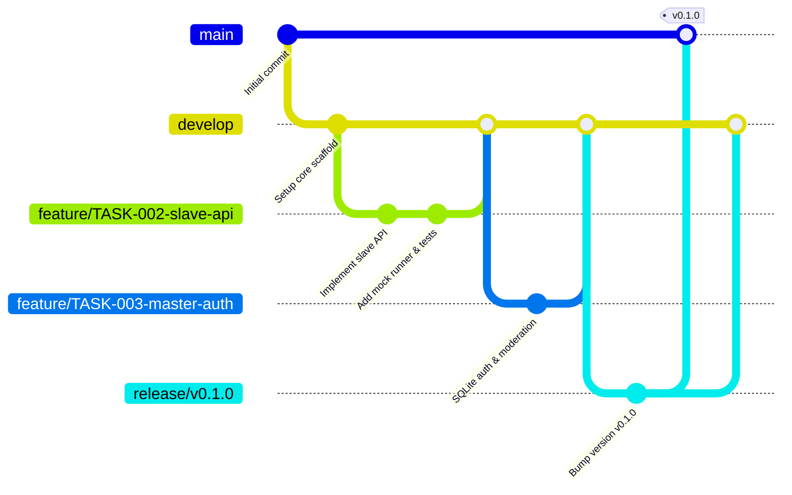

# AGENTS.md — Avari Keys MVP AI Agent Guidelines & Gitflow Manual

Этот документ определяет правила совместной работы AI-агентов (Antigravity & Codex), архитектурные инварианты, ролевую модель, Gitflow-процессы и политики экономии контекста.

---

## 1. Концепция и границы системы

**Avari Keys MVP** — легковесная распределенная система управления конфигурациями AmneziaWG (AWG) поверх скрипта `manage_amneziawg.sh`.

- **Стек бэкенда**: Go 1.22+ (`CGO_ENABLED=0`, чистый Go SQLite через `modernc.org/sqlite`).
- **Стек фронтенда**: React / TypeScript / Vite / Tailwind CSS.
- **Интеграция с AWG**: Вся работа с интерфейсами, портами, ключами и пирами AmneziaWG осуществляется исключительно через CLI-вызовы `manage_amneziawg.sh`.
- **Никаких сложных сетевых оверхедов**: сетевую маршрутизацию и каскад настраивает `amneziawg-installer` (`CASCADE.md`).

---

## 2. Ключевые архитектурные инварианты

1. **Zero CGo / Static Single Binary**:
   - Master Backend и Slave API должны компилироваться в статичные бинарники без внешних C-зависимостей (`CGO_ENABLED=0`).
2. **Безопасность API Slave**:
   - Все запросы от Master к Slave защищены токеном (`X-API-Key` или `Authorization: Bearer <TOKEN>`).
   - На Slave по умолчанию на root-эндпоинте `/` отдается нейтральная страница-заглушка (Decoy).
3. **Модерация пользователей**:
   - При регистрации аккаунт получает статус `is_active = false`.
   - Пользователь не может создавать ключи до подтверждения учетной записи администратором.
4. **Изоляция приватных ключей**:
   - Приватные ключи клиентов генерируются через `manage_amneziawg.sh` и передаются пользователю при создании/просмотре.
   - Master хранит только метаданные (`client_name`, `public_key`, `node_id`, `user_id`, `created_at`).
5. **Границы тестирования**:
   - Тестируются только контракты API, DTO, SQLite-хранилище, бизнес-логика модерации и HTTP-клиенты к Slave.
   - Работа самого ядра AmneziaWG **не тестируется** (эмулируется через mock runner для `manage_amneziawg.sh`).

---

## 3. Gitflow и управление ветками / воркспейсами

Агенты обязаны строго следовать Gitflow:



### Правила веток:
1. **`main`**: Защищенная ветка. Содержит только готовые к релизу версии с тегами `vX.Y.Z`. Прямые коммиты запрещены.
2. **`develop`**: Главная интеграционная ветка. В нее сливаются протестированные `feature/*` ветки.
3. **`feature/<TASK-ID>-<slug>`**:
   - Ветка под конкретную задачу из `_docs/TASKS.md` (например, `feature/TASK-002-slave-api`).
   - Создается от актуального `develop`.
   - По завершении и успешном прохождении тестов сливается в `develop` (через `git merge --no-ff` или rebase).
4. **`release/vX.Y.Z`**:
   - Создается от `develop` при подготовке релиза.
   - Проводится финальная проверка контрактов, обновление версий и документации.
   - Сливается в `main` (с простановкой тега) и обратно в `develop`.

---

## 4. Ролевая модель агентов (Antigravity & Codex)

| Роль | Основная модель | Зона ответственности | Доступные инструменты |
|---|---|---|---|
| **Оркестратор (Orchestrator)** | `pro` / `medium` | Декомпозиция задач, ведение `_docs/TASKS.md`, контроль Gitflow, запуск субагентов, финальный мерж. | Управление агентами, чтение, планирование |
| **Архитектор (Architect)** | `pro` / `medium` | Проектирование контрактов API, схемы SQLite, спецификаций DTO и архитектурных документов. | Чтение, генерация схем и спецификаций |
| **Разработчик (Developer)** | `flash` / `medium` | Написание кода на Go и React/TypeScript, реализация бизнес-логики, создание модульных/контрактных тестов. | Чтение, Запись файлов, Запуск команд |
| **Тестировщик (QA / Tester)** | `flash` / `medium` | Запуск тестов, проверка соответствия контрактам, линтинг, валидация по чек-листам задач. | Чтение, Запуск тестов, Правка тестов |

---

## 5. Протокол взаимодействия и передачи задач (Handoff)

Передача задачи между агентами фиксируется в формате:

```markdown
### Handoff: [Role -> Role]
- **Ветка**: `feature/TASK-XXX-...`
- **Объем изменений**: [Кратко 1-2 предложения]
- **Ключевые файлы**: [`path/file.go#L10-L40`](file:///path/file.go#L10-L40)
- **Результаты проверки**: [Команда запуска тестов и статус PASS/FAIL]
- **Следующий шаг / Риски**: [Четкое указание следующему агенту]
```

---

## 6. Команды верификации

```bash
# 1. Проверка Go кода и тестов (Slave & Master)
cd apps/backend && go vet ./...
cd apps/backend && go test -v -race ./...

# 2. Проверка сборки статических бинарников
cd apps/backend && CGO_ENABLED=0 go build -o /dev/null ./cmd/slave
cd apps/backend && CGO_ENABLED=0 go build -o /dev/null ./cmd/master

# 3. Проверка фронтенда
cd apps/frontend && npm run build
```
