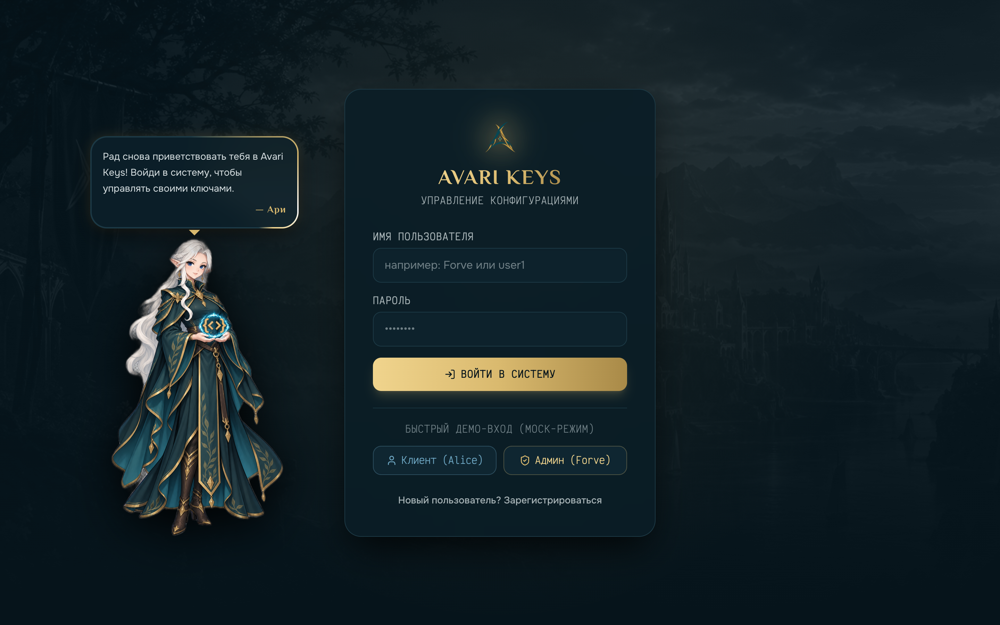
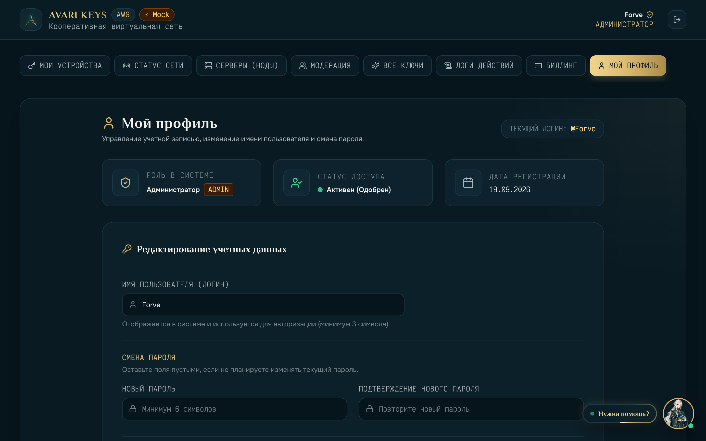
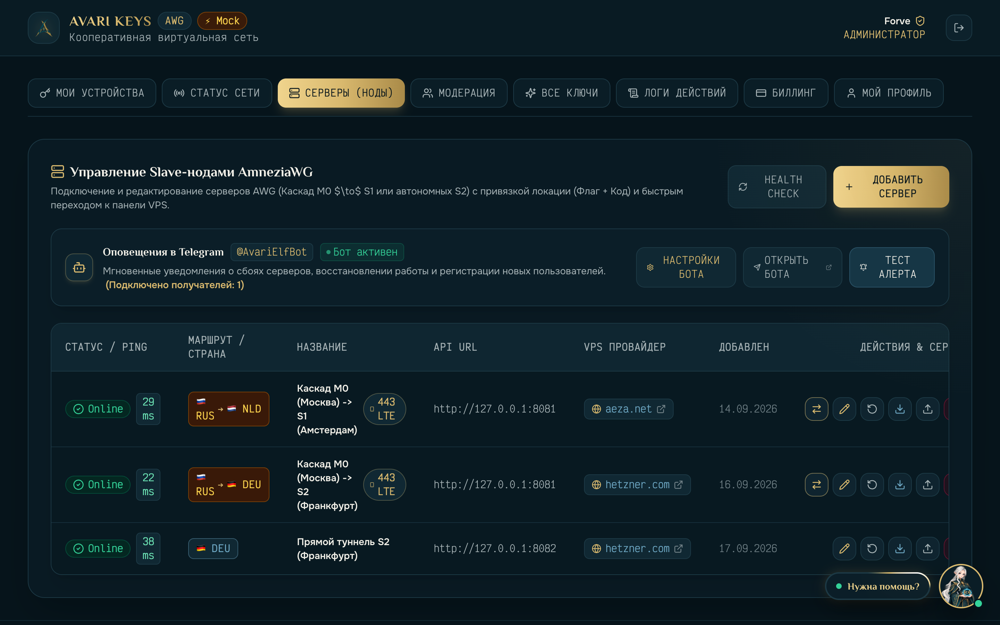
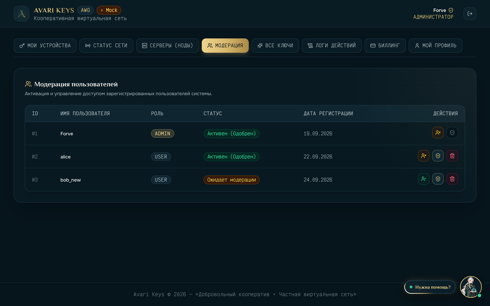
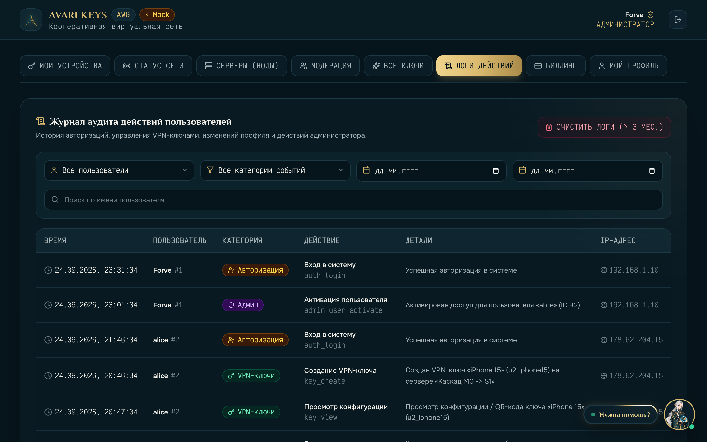
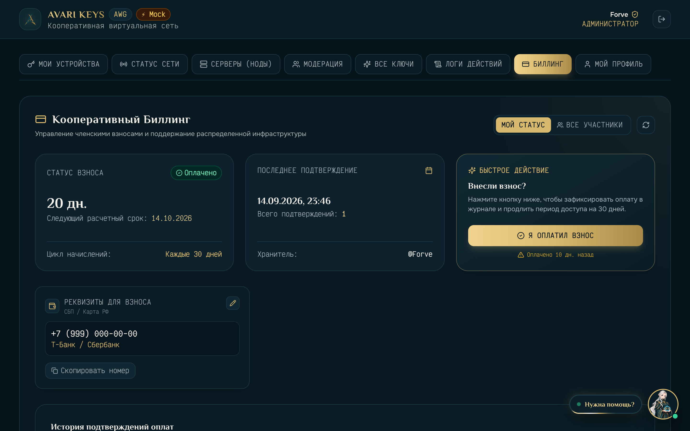
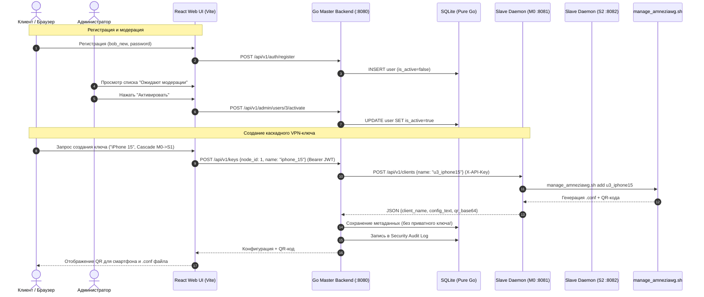

<div align="center">

  

  # AVARI KEYS MVP
  ### 🛡️ Распределенная система оркестрации и управления AmneziaWG VPN-ключами

  [](https://go.dev/)
  [-success?style=for-the-badge&logo=linux&logoColor=white)](https://pkg.go.dev/modernc.org/sqlite)
  [](https://react.dev/)
  [](https://www.typescriptlang.org/)
  [](https://tailwindcss.com/)
  [-E5A93C?style=for-the-badge&logo=wireguard&logoColor=white)](https://github.com/amnezia-vpn)
  [](./LICENSE)

  <p align="center">
    <b>Полнофункциональная enterprise-grade панель для self-hosted управления VPN-инфраструктурой</b><br/>
    Двухкаскадное туннелирование (РФ &rarr; EU) против блокировок DPI, изоляция ключей, Zero-CGo статические бинарники, журнал аудита и кооперативный биллинг.
  </p>

  <p align="center">
    <a href="#-быстрый-старт-демо-режим-за-30-секунд">⚡ Быстрый запуск Демо</a> •
    <a href="#-галерея-интерфейса-mock-mode">📸 Скриншоты UI</a> •
    <a href="#-архитектура-и-сетевая-топология">🏛 Архитектура</a> •
    <a href="#-технологический-стек">🛠 Стек технологий</a> •
    <a href="#-инженерные-решения-highlights">💡 Highlights</a>
  </p>

</div>

---

## 🌟 Ключевые возможности

- 🛡️ **Двухкаскадное туннелирование (Double-Hop Cascade)**:
  - **РФ Ingress $\to$ EU Egress**: Входной узел в РФ маскирует трафик от локальных провайдеров и перенаправляет его на зарубежную ноду выхода.
  - **Автономные прямые ноды (Direct Nodes)**: Прямые высокоскоростные туннели без промежуточных звеньев.
- ⚡ **Zero-CGo и статические бинарники**:
  - Компиляция `CGO_ENABLED=0` без системных `libc` зависимостей.
  - Реляционная SQLite база данных на чистом Go ([`modernc.org/sqlite`](https://pkg.go.dev/modernc.org/sqlite)).
  - Запуск на любом Linux-дистрибутиве (Ubuntu, Debian, Alpine, CentOS) через единственный легковесный бинарник (~18 МБ).
- 📱 **AmneziaWG протокол и параметры обфускации DPI**:
  - Генерация конфигураций с кастомными заголовками обфускации (`Jc`, `Jmin`, `Jmax`, `S1`, `S2`, `H1-H4`).
  - Мгновенный импорт по QR-коду для iOS / Android клиентов и скачивание готовых `.conf` файлов для ПК.
- 🛰️ **Распределенный Slave API Daemon с Decoy-маскировкой**:
  - Тонкий HTTP API демон над скриптом `manage_amneziawg.sh` ([amneziawg-installer](https://github.com/bivlked/amneziawg-installer)).
  - Авторизация Master $\leftrightarrow$ Slave по токену (`X-API-Key`).
  - Decoy: нейтральная HTML-заглушка на корневом эндпоинте `/`, маскирующая назначение сервера от сканеров портов.
- 👥 **Ролевая модель и строгая модерация**:
  - Защищенная регистрация: новые пользователи получают статус `is_active = false` и не могут создавать ключи до подтверждения администратором.
  - Лимиты устройств и гибкое управление квотами.
- 📜 **Журнал аудита безопасности (Security Audit Log)**:
  - Фиксация всех системных событий (авторизации, создание/отзыв ключей, смена паролей, действия модератора) с сохранением IP-адресов и метаданных.
  - Фильтрация по датам, категориям, пользователям и экспорт данных.
- 💳 **Кооперативный биллинг (Fair-Share Ledger)**:
  - Трекер 30-дневных циклов добровольных взносов на оплату серверов.
  - Быстрая оплата по СБП / реквизитам с историей подтверждений.
- 🤖 **Интерактивный AI-помощник (Ари) и База знаний FAQ**:
  - Встроенный интерактивный гид по первой настройке подключения.
  - Интеграция с Telegram Bot (настраивается через веб-интерфейс) для мгновенных алертов о здоровье серверов.

---

## 📸 Галерея интерфейса (Mock Mode)

Все скриншоты сняты в **автоматическом Демо-режиме** без необходимости подключения к реальным серверам AmneziaWG:

### 1. Экран авторизации и Демо-вход
> Фирменный Cyber-Fantasy дизайн, статусная анимация и встроенный выбор демо-ролей (Alice / Admin Forve):

<div align="center">
  
</div>

---

### 2. Личный кабинет пользователя и список VPN-ключей
> Список активных конфигураций, индикация типа ноды (Каскад РФ $\to$ Нидерланды / Германия), счетчики трафика и кнопка быстрого просмотра:

<div align="center">
  
</div>

---

### 3. Модальное окно ключа: AmneziaWG QR-код и параметры обфускации
> Генерация QR-кода на лету для мобильного приложения AmneziaWG, подсветка параметров защиты от DPI (`Jc`, `Jmin`, `Jmax`, `S1`, `S2`, `H1-H4`), копирование и скачивание `.conf`:

<div align="center">
  
</div>

---

### 4. Панель администратора: Управление серверами (Ноды AWG)
> Мониторинг распределенных Slave-нод, статус доступности (Health Check), пинг, провайдеры и Telegram-оповещения:

<div align="center">
  
</div>

---

### 5. Панель администратора: Модерация и квоты пользователей
> Очередь подтверждения новых регистраций, активация аккаунтов в 1 клик и назначение ролей:

<div align="center">
  
</div>

---

### 6. Журнал аудита безопасности (Security Audit Logs)
> Полный аудит действий в системе: IP-адреса, временные метки, категории событий и фильтры:

<div align="center">
  
</div>

---

### 7. Кооперативный биллинг (Совместное содержание)
> Прозрачный учет 30-дневного расчетного периода, реквизиты для продления и история оплат:

<div align="center">
  
</div>

---

## 🏛 Архитектура и сетевая топология

Система разделена на **Master** (центральный координатор с БД и Web UI) и **Slave** (минималистичные агенты на нодах с установленным AmneziaWG):

```
                       ┌────────────────────────────────────────────────┐
                       │             ПОЛЬЗОВАТЕЛЬСКИЙ ТРАФИК            │
                       └────────────────────────────────────────────────┘
                                                │
                 ┌──────────────────────────────┴──────────────────────────────┐
                 │ (Каскадное подключение)                                     │ (Прямое подключение)
                 ▼                                                             ▼
    ┌─────────────────────────┐                                   ┌─────────────────────────┐
    │     M0 (Россия/РФ)      │                                   │       S2 (Германия)     │
    │  • Cascade Ingress      │                                   │  • Direct Standalone    │
    │  • amneziawg0 interface │                                   │  • amneziawg0 interface │
    └────────────┬────────────┘                                   └────────────┬────────────┘
                 │ (Зашифрованный туннель)                                     │
                 ▼                                                             │
    ┌─────────────────────────┐                                                │
    │      S1 (Нидерланды)    │                                                │
    │  • Cascade Egress       │                                                │
    │  • NAT / Direct Out     │                                                │
    └────────────┬────────────┘                                                │
                 │                                                             │
                 └──────────────────────────────┬──────────────────────────────┘
                                                ▼
                                         [ ВЕСЬ ИНТЕРНЕТ ]
```

### Потоки управления и API-взаимодействие (Control Plane):



---

## 🛠 Технологический стек

| Слой | Технологии | Назначение / Особенности |
|---|---|---|
| **Backend Core** | **Go 1.22+** | Высокая производительность, статическая линковка, низкое потребление RAM (< 30 МБ). |
| **Сборка & CGo** | `CGO_ENABLED=0` | Полное отсутствие C-зависимостей, идеальная переносимость на любые Linux ядра. |
| **База данных** | **`modernc.org/sqlite`** | Встроенный чистый Go SQLite драйвер с поддержкой транзакций, миграций и WAL-режима. |
| **Безопасность** | `golang-jwt/jwt/v5`, `golang.org/x/crypto/bcrypt` | Авторизация через JWT-токены, хеширование паролей bcrypt, изоляция private keys. |
| **Frontend UI** | **React 18**, **TypeScript 5.5** | Типобезопасный SPA интерфейс с компонентной архитектурой. |
| **Сборка FE** | **Vite 5** | Сверхбыстрая сборка, HMR, оптимизация production бандлов. |
| **Стилизация** | **Tailwind CSS 3.4**, `lucide-react` | Адаптивный дизайн (Mobile 320px &rarr; 4K), Cyber-Fantasy тема, стеклянные панели (Glassmorphism). |
| **VPN Engine** | **AmneziaWG (AWG)** | Протокол WireGuard с обфускацией заголовков против DPI-фильтрации провайдеров. |
| **Инфраструктура** | **Caddy Server**, **systemd**, **GitHub Actions** | Автоматический Let's Encrypt HTTPS, атомарный SSH CI/CD деплой за секунды. |

---

## ⚡ Быстрый старт (Демо-режим за 30 секунд)

Для локального ознакомления с интерфейсом не требуется установленный AmneziaWG или Linux VPS:

```bash
# 1. Клонирование репозитория
git clone https://github.com/OstKost/avari-keys-mvp.git
cd avari-keys-mvp

# 2. Установка зависимостей фронтенда
cd apps/frontend
npm install

# 3. Запуск встроенного Демо-режима (Mock Mode)
npm run dev:mock
```

Откройте в браузере **`http://localhost:5173`** и выберите:
- 🛡️ **Админ (Forve)** — полный доступ к серверам, модерации, аудиту и биллингу.
- 👤 **Клиент (Alice)** — личный кабинет пользователя с созданными ключами.

---

## 💻 Полноценный запуск в среде разработки

### Требования:
- Go 1.22+
- Node.js 20+
- Linux (для реального вызова `manage_amneziawg.sh`) или macOS/Windows (с mock runner).

### Запуск всех компонентов через Makefile:

```bash
# Сборка статических бинарников Master и Slave
make build

# Запуск всех модульных, контрактных и интеграционных тестов
make test

# Проверка линтером и компилятором
make vet
```

---

## 💡 Инженерные решения (Highlights)

### 1. Почему Zero-CGo (`CGO_ENABLED=0`)?
* **Идеальная переносимость**: Бинарник не привязан к системной версии `glibc` сервера сборщика. Собранный в GitHub Actions файл работает на Ubuntu 20.04, Debian 12 или Alpine.
* **Trivial Cross-Compilation**: Сборка под `linux/arm64` (AWS Graviton, Raspberry Pi) выполняется одной командой `GOOS=linux GOARCH=arm64 go build` без установки GCC кросс-компиляторов.
* **Быстрый CI/CD**: Сборка и деплой занимают менее 5 секунд.

### 2. Zero-Knowledge изоляция приватных ключей
* Сервер **Master** не хранит приватные ключи клиентов в SQLite.
* Ключ генерируется скриптом `manage_amneziawg.sh` на Slave-ноде и возвращается клиенту в момент создания. В базе Master сохраняются только метаданные (`client_name`, `public_key`, `node_id`, `created_at`).

### 3. Защита Slave-нод и Decoy Camouflage
* При прямом обращении к Slave API по HTTP выдается нейтральная HTML-страница (Decoy), скрывающая факт работы VPN-сервиса.
* Все управляющие эндпоинты защищены строгой проверкой заголовка `X-API-Key`.

### 4. Автоматический CI/CD пайплайн
* При пуше в `develop` или `main` GitHub Actions запускает тесты, собирает статические бинарники Master & Slave, минифицирует фронтенд и производит атомарную доставку через SSH на боевой сервер.

---

## 📁 Структура проекта

```
avari-keys-mvp/
├── _docs/                  # Архитектурная документация, сетевые схемы и Kanban
│   ├── ARCHITECTURE.md     # Спецификация сетевой топологии и API
│   ├── CASCADE_SIMPLE.md   # Руководство по настройке 2-hop каскада
│   ├── DEPLOY.md           # Инструкция по развертыванию на VPS
│   ├── CICD.md             # Описание GitHub Actions пайплайна
│   ├── TASKS.md            # Kanban-доска проекта
│   └── screenshots/        # Скриншоты интерфейса Демо-режима
├── apps/
│   ├── backend/            # Go 1.22+ Backend (Master + Slave Daemon)
│   │   ├── cmd/
│   │   │   ├── master/     # Точка входа Master Backend
│   │   │   └── slave/      # Точка входа Slave API Daemon
│   │   └── internal/       # Clean Architecture (auth, db, node, client, audit)
│   └── frontend/           # React 18 + TypeScript + Tailwind SPA
│       ├── src/
│       │   ├── api/        # REST API клиент + встроенный MockClient
│       │   ├── components/ # Компоненты UI (Модалки, Дашборд, Маскот, Логи)
│       │   └── types/      # DTO и интерфейсы
├── deploy/                 # Конфигурации Caddy, systemd и скрипты инсталляции
├── scripts/                # Скрипты захвата скриншотов и вспомогательные утилиты
├── Makefile                # Команды автоматизации (build, test, lint, dev)
└── README.md               # Презентация проекта для портфолио
```

---

## 📄 Лицензия

Проект распространяется под лицензией **MIT**. Подробности в файле [LICENSE](./LICENSE).

---

<div align="center">
  <sub>Разработано с ❤️ как демонстрация проектирования надежных распределенных сетевых систем на Go и React.</sub>
</div>
