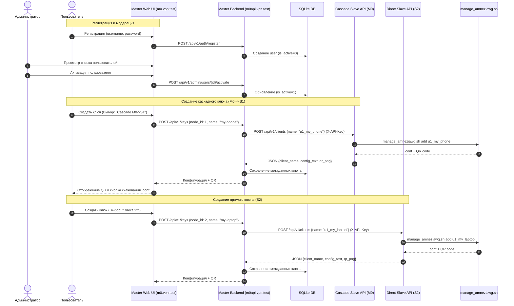

# Архитектура и сетевая топология Avari Keys MVP

## 1. Введение и концепция
Проект **Avari Keys MVP** предназначен для управления клиентами AmneziaWG (AWG) в распределенной схеме:
1. **Каскад (Cascade)**: российский сервер-вход (M0) перенаправляет трафик через зарубежный сервер-выход (S1). Российские провайдеры видят соединение клиента с РФ-сервером (M0), а интернет видит выход с зарубежного IP (S1).
2. **Прямое туннелирование (Direct)**: зарубежный сервер (S2) для прямого подключения без промежуточных звеньев.

Управление ключами и пирами на уровне ОС полностью возложено на официальный скрипт `manage_amneziawg.sh` от [bivlked/amneziawg-installer](https://github.com/bivlked/amneziawg-installer).

---

## 2. Физическая топология серверов и домены

| Сервер | Локация | Роль в VPN | Сервисы | Доменные имена (Let's Encrypt) |
|---|---|---|---|---|
| **M0** | РФ (Россия) | Master + Cascade Ingress | 1. Web UI (Frontend) 2. Master Backend API 3. Cascade Slave API (AWG) | `m0.vpn.test` (Frontend) `m0api.vpn.test` (Backend API) `s1.vpn.test` (Cascade Slave API) |
| **S1** | Зарубеж (EU/US) | Cascade Egress | 1. AWG Egress Gateway *(настроен по CASCADE.md)* | *(управляется через M0)* |
| **S2** | Зарубеж (EU/US) | Standalone Direct Node | 1. Direct Slave API (AWG) 2. Decoy / Stub Web Site | `s2.vpn.test` (Direct Slave API + Decoy) |

---

## 3. Взаимодействие компонентов

---

## 4. Спецификация Slave API

Slave API запускается как системный демон `systemd` на каждом сервере, где физически установлен интерфейс AWG для клиентов (M0 для каскада и S2 для прямого туннеля).

### Аутентификация:
Заголовок `X-API-Key: <Сгенерированный_Токен>`

### Эндпоинты:
1. `GET /` — отдает нейтральную HTML-заглушку (Decoy), скрывающую назначение сервера.
2. `GET /health` — проверка работы сервиса и наличия `manage_amneziawg.sh`.
3. `POST /api/v1/clients`
   - Body: `{"name": "string"}`
   - Ответ: `{"name": "string", "config": "string", "qr_base64": "string"}`
4. `GET /api/v1/clients`
   - Ответ: `[{"name": "string", "created_at": "string"}]`
5. `GET /api/v1/clients/{name}`
   - Ответ: `{"name": "string", "config": "string", "qr_base64": "string"}`
6. `DELETE /api/v1/clients/{name}`
   - Вызывает `manage_amneziawg.sh remove <name>`
   - Ответ: `{"success": true}`
7. `GET /api/v1/stats`
   - Вызывает `manage_amneziawg.sh stats --json`
   - Ответ: JSON со статистикой переданного трафика и последних рукопожатий.
