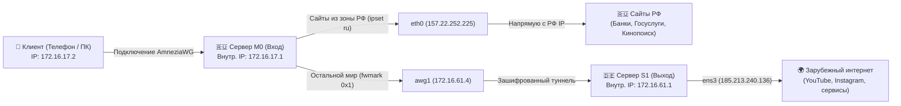

# Пошаговая инструкция: Каскад AmneziaWG (Сплит-туннель РФ ➔ Зарубеж)

> **Суть схемы**: Вы подключаетесь с телефона или ноутбука к российскому серверу (M0). 
> - Российские сайты (Госуслуги, банки, Кинопоиск, Яндекс) открываются напрямую с **российского IP** быстро и без блокировок.
> - Весь зарубежный интернет (YouTube, Instagram, заблокированные ресурсы) автоматически уходит через шифрованный туннель на **зарубежный сервер (S1)** и выходит с европейским IP.

---

## 🧠 1. Простое объяснение IP-адресов и подсетей (Где чаще всего ошибаются)

В каскаде участвуют **два типа адресов**, которые категорически нельзя путать:

```
+---------------------------------------------------------------------------------------+
| 1. ВНЕШНИЕ (ПУБЛИЧНЫЕ) IP-АДРЕСА                                                      |
| Это реальные адреса ваших серверов в интернете (выдает хостинг):                      |
| • Сервер M0 (РФ / Вход):   157.22.252.225                                             |
| • Сервер S1 (DE / Выход):  185.213.240.136                                            |
+---------------------------------------------------------------------------------------+
                                           |
                                           v
+---------------------------------------------------------------------------------------+
| 2. ВНУТРЕННИЕ (ВИРТУАЛЬНЫЕ) ПОДСЕТИ VPN                                               |
| Это невидимые из интернета адреса внутри зашифрованного кабеля (как дома 192.168.1.x):|
| • Сеть клиентов на M0:     172.16.17.1/24  (клиенты получают 172.16.17.2, .3, ...)   |
| • Сеть каскада на S1:      172.16.61.1/24  (сервер M0 подключается как 172.16.61.4)  |
+---------------------------------------------------------------------------------------+
```

### ⚠️ Главные правила:
1. **Никогда не указывайте публичные IP в параметре `--subnet`**! Если указать публичную подсеть сервера, VPN перехватит адрес реального интернет-шлюза провайдера, и сеть полностью сломается.
2. **Подсети на двух серверах обязаны быть разными**:
   - На сервере M0: `172.16.17.1/24`
   - На сервере S1: `172.16.61.1/24`
3. **Что такое `/24` и `/32`?**
   - `/24` — это подсеть на 254 адреса (выделяется на интерфейс сервера для раздачи клиентам).
   - `/32` — это один конкретный IP-адрес (выделяется одному конкретному устройству или клиенту).

---

## 🗺️ 2. Схема движения трафика



---

## 🛠️ 3. Пошаговая настройка

### ШАГ 1: Настройка Сервера-выхода S1 (Германия / Зарубеж)

Подключитесь по SSH к **S1 (`185.213.240.136`)**:

1. **Чистая установка AmneziaWG**:
   ```bash
   systemctl stop awg-quick@awg0 2>/dev/null || true
   bash <(curl -sSL https://raw.githubusercontent.com/bivlked/amneziawg-installer/main/install_amneziawg.sh) --yes --disallow-ipv6 --route-all --mobile --subnet=172.16.61.1/24
   ```

2. **Создаем конфигурацию туннеля для сервера M0**:
   ```bash
   bash /root/awg/manage_amneziawg.sh add ru_host
   ```

3. **Смотрим получившийся файл**:
   ```bash
   cat /root/awg/ru_host.conf
   ```
   *Этот файл содержит ключи и параметры обфускации. Мы перенесем его на M0 на следующем шаге.*

---

### ШАГ 2: Настройка Сервера-входа M0 (Россия)

Подключитесь по SSH к **M0 (`157.22.252.225`)**:

1. **Установка AmneziaWG и утилит маршрутизации**:
   ```bash
   systemctl stop awg-quick@awg0 2>/dev/null || true
   systemctl stop awg-quick@awg1 2>/dev/null || true
   bash <(curl -sSL https://raw.githubusercontent.com/bivlked/amneziawg-installer/main/install_amneziawg.sh) --yes --disallow-ipv6 --route-all --mobile --subnet=172.16.17.1/24
   apt update && apt install -y curl ipset
   ```

2. **Создаем каскадный интерфейс к серверу S1**:
   Откройте редактор:
   ```bash
   nano /etc/amnezia/amneziawg/awg1.conf
   ```
   Вставьте содержимое из `ru_host.conf` (с сервера S1), соблюдая правила:
   - В секцию `[Interface]` **обязательно добавьте**: `Table = off` (чтобы туннель не перехватывал всю маршрутизацию сервера автоматически).
   - Удалите строку `DNS = ...` (серверу она не нужна).
   - **Строго без пробелов в начале строк!**

   *Пример готового `/etc/amnezia/amneziawg/awg1.conf`:*
   ```ini
   [Interface]
   PrivateKey = ВАШ_ПРИВАТНЫЙ_КЛЮЧ_ИЗ_RU_HOST
   Address = 172.16.61.4/32
   MTU = 1280
   Table = off
   Jc = 3
   Jmin = 35
   Jmax = 114
   S1 = 146
   S2 = 130
   S3 = 14
   S4 = 13
   H1 = ...
   H2 = ...
   H3 = ...
   H4 = ...
   I1 = ...

   [Peer]
   PublicKey = ПУБЛИЧНЫЙ_КЛЮЧ_СЕРВЕРА_S1
   Endpoint = 185.213.240.136:443
   AllowedIPs = 0.0.0.0/0, ::/0
   PersistentKeepalive = 33
   ```
   Сохраните файл (`Ctrl + O` $\to$ `Enter`, `Ctrl + X`).

3. **Запустите и проверьте каскадный туннель**:
   ```bash
   chmod 600 /etc/amnezia/amneziawg/awg1.conf
   awg-quick up awg1
   awg show awg1
   ```
   *В выводе должна появиться строка `latest handshake: X seconds ago`*.

---

### ШАГ 3: Скрипт сплит-маршрутизации (на сервере M0)

1. Создайте скрипт:
   ```bash
   nano /root/awg/awg-routing.sh
   ```

2. Вставьте в него код:
   ```bash
   #!/bin/bash
   set -euo pipefail

   CLIENT_SUBNET="172.16.17.0/24"
   AWG1_IF="awg1"
   AWG1_ENDPOINT="185.213.240.136"
   TABLE_ID=100
   FWMARK="0x1"
   RULE_PRIO=10000
   RU_ZONE_URL="https://www.ipdeny.com/ipblocks/data/aggregated/ru-aggregated.zone"
   RU_ZONE_FALLBACK_URL="https://raw.githubusercontent.com/bivlked/amneziawg-installer/v5.36.1/cascade/ru.zone"
   AWG_DIR="/root/awg"
   EXTRA_RU_NETS=""

   RU_ZONE="$AWG_DIR/ru.zone"
   mkdir -p "$AWG_DIR"

   exec 9>"$AWG_DIR/awg-routing.lock"
   flock -w 300 9 || { echo "ERROR: lock failed" >&2; exit 1; }
   trap 'rm -f "$RU_ZONE.tmp"' EXIT

   EP_ROUTE="$(ip -4 route get "$AWG1_ENDPOINT" 2>/dev/null)" || {
       echo "ERROR: не могу определить маршрут к $AWG1_ENDPOINT" >&2
       exit 1
   }
   WAN_DEV="$(echo "$EP_ROUTE" | grep -oP '(?<=dev )\S+')"
   WAN_GW="$(echo "$EP_ROUTE" | grep -oP '(?<=via )\S+' || true)"

   echo "Загрузка списка российских сетей..."
   if ! curl -fsSL --connect-timeout 10 --max-time 60 "$RU_ZONE_URL" -o "$RU_ZONE.tmp"; then
       echo "Основной URL недоступен, пробуем fallback..."
       curl -fsSL --connect-timeout 10 --max-time 60 "$RU_ZONE_FALLBACK_URL" -o "$RU_ZONE.tmp"
   fi
   mv "$RU_ZONE.tmp" "$RU_ZONE"

   ipset create ru hash:net -exist
   ipset create ru_tmp hash:net -exist
   ipset flush ru_tmp

   while read -r net; do
       [[ "$net" =~ ^[0-9] ]] && ipset add ru_tmp "$net" -exist
   done < "$RU_ZONE"

   for net in $EXTRA_RU_NETS; do
       ipset add ru_tmp "$net" -exist
   done

   ipset swap ru ru_tmp
   ipset destroy ru_tmp

   # Правила фильтрации и меток трафика
   iptables -t mangle -C PREROUTING -s "$CLIENT_SUBNET" -m set --match-set ru dst -j RETURN 2>/dev/null || \
       iptables -t mangle -A PREROUTING -s "$CLIENT_SUBNET" -m set --match-set ru dst -j RETURN

   iptables -t mangle -C PREROUTING -s "$CLIENT_SUBNET" -j MARK --set-mark "$FWMARK" 2>/dev/null || \
       iptables -t mangle -A PREROUTING -s "$CLIENT_SUBNET" -j MARK --set-mark "$FWMARK"

   iptables -t mangle -C FORWARD -p tcp --tcp-flags SYN,RST SYN -j TCPMSS --clamp-mss-to-pmtu 2>/dev/null || \
       iptables -t mangle -A FORWARD -p tcp --tcp-flags SYN,RST SYN -j TCPMSS --clamp-mss-to-pmtu

   iptables -t nat -C POSTROUTING -s "$CLIENT_SUBNET" -o "$AWG1_IF" -j MASQUERADE 2>/dev/null || \
       iptables -t nat -A POSTROUTING -s "$CLIENT_SUBNET" -o "$AWG1_IF" -j MASQUERADE

   iptables -t nat -C POSTROUTING -s "$CLIENT_SUBNET" -o "$WAN_DEV" -j MASQUERADE 2>/dev/null || \
       iptables -t nat -A POSTROUTING -s "$CLIENT_SUBNET" -o "$WAN_DEV" -j MASQUERADE

   # Таблица маршрутизации 100 для зарубежного выхода
   ip route replace default dev "$AWG1_IF" table "$TABLE_ID"

   if ! ip rule show | grep -q "fwmark $FWMARK lookup $TABLE_ID"; then
       ip rule add fwmark "$FWMARK" table "$TABLE_ID" prio "$RULE_PRIO"
   fi

   echo "Каскадная маршрутизация успешно настроена!"
   ```
   Сохраните файл (`Ctrl + O` $\to$ `Enter`, `Ctrl + X`).

3. **Сделайте исполняемым и запустите**:
   ```bash
   chmod +x /root/awg/awg-routing.sh
   bash /root/awg/awg-routing.sh
   ```

---

### ШАГ 4: Настройка автозапуска при перезагрузке (Systemd + Cron)

Чтобы туннель и сплит-маршрутизация не слетали при перезагрузке сервера M0:

1. **Создайте unit-файл `/etc/systemd/system/awg-routing.service`**:
   ```bash
   nano /etc/systemd/system/awg-routing.service
   ```
   Вставьте текст:
   ```ini
   [Unit]
   Description=Каскадный сплит-роутинг для AWG0
   After=awg-quick@awg0.service awg-quick@awg1.service network-online.target
   Requires=awg-quick@awg0.service awg-quick@awg1.service
   Wants=network-online.target

   [Service]
   Type=oneshot
   RemainAfterExit=yes
   ExecStart=/root/awg/awg-routing.sh

   [Install]
   WantedBy=multi-user.target
   ```
   *(Сохраните: `Ctrl + O` $\to$ `Enter`, `Ctrl + X`)*.

2. **Включите автозапуск**:
   ```bash
   systemctl daemon-reload
   systemctl enable awg-quick@awg1 awg-routing
   ```

3. **Добавьте автообновление списка российских сетей в `cron`**:
   ```bash
   (crontab -l 2>/dev/null; echo "0 4 * * * /root/awg/awg-routing.sh >/dev/null 2>&1") | crontab -
   ```

---

## 📱 4. Создание клиентских ключей и проверка

На **сервере M0** создаем ключ для устройства:
```bash
bash /root/awg/manage_amneziawg.sh add myphone
```

Импортируйте файл или QR-код в приложение **AmneziaWG** на телефоне/ПК.

### Тестирование:
1. Зайдите на **[2ip.ru](https://2ip.ru)** $\to$ Должен определяться **Российский IP (M0 — `157.22.252.225`)**.
2. Зайдите на **[whatismyipaddress.com](https://whatismyipaddress.com)** или заблокированные ресурсы $\to$ Должен определяться **Немецкий IP (S1 — `185.213.240.136`)**.
3. Российские сервисы (банки, Госуслуги, Кинопоиск) работают без ограничений.
