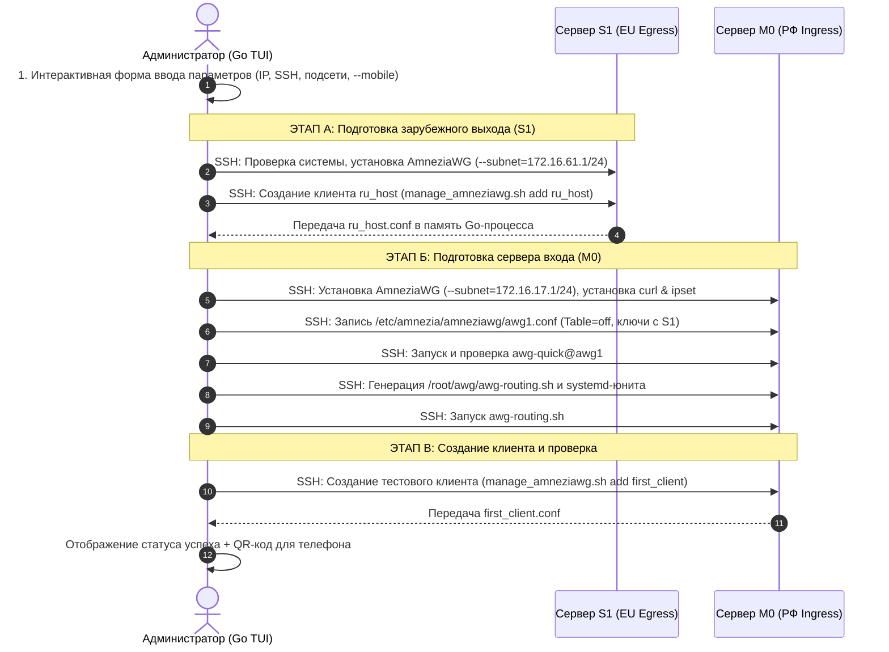

# Спецификация и план реализации Go TUI Оркестратора каскада AmneziaWG (`TUI.md`)

## 1. Цель и концепция

**Avari Cascade TUI (`avari-cascade`)** — автономная интерактивная консольная утилита (TUI) на языке Go, предназначенная для полностью автоматизированного развертывания, настройки и проверки каскадной VPN-связки из двух серверов:
1. **Сервер M0 (РФ / Ingress)**: Сервер входа для клиентов, делит трафик на российский (напрямую) и зарубежный (в каскад).
2. **Сервер S1 (EU / Egress)**: Сервер выхода в зарубежный интернет.

Утилита запускается на локальном компьютере администратора (macOS / Linux / Windows), по SSH подключается к обоим серверам и выполняет всю рутинную настройку без ручного копирования ключей и редактирования конфигов.

---

## 2. Технологический стек

- **Язык**: Go 1.22+ (`CGO_ENABLED=0`, статический бинарник).
- **TUI Framework**: [Charmbracelet Bubble Tea](https://github.com/charmbracelet/bubbletea) & [Huh?](https://github.com/charmbracelet/huh) (современные формы, селекторы, валидаторы).
- **Стили и компоненты**: [Lip Gloss](https://github.com/charmbracelet/lipgloss) (красивые рамки, цвета, статусы).
- **SSH Движок**: `golang.org/x/crypto/ssh` + SFTP / `scp` для безопасного исполнения команд и передачи конфигов.
- **Сетевая валидация**: `net.IPNet`, `net.ParseCIDR` (гарантия отсутствия коллизий подсетей и шлюзов).
- **Генерация QR-кодов**: `github.com/skip2/go-qrcode` (вывод ASCII QR-кода клиента прямо в терминал).

---

## 3. Схема работы и межсерверный пайплайн



---

## 4. Пошаговые экраны мастера (TUI User Flow)

### Экран 1: Подключение к серверам (Server Credentials)
- **Сервер M0 (РФ)**:
  - `Host / IP`: (например, `157.22.252.225`)
  - `SSH Port`: по умолчанию `22`
  - `SSH User`: по умолчанию `root`
  - `Auth Method`: `SSH Key (~/.ssh/id_ed25519)` или `Password`
- **Сервер S1 (EU)**:
  - `Host / IP`: (например, `185.213.240.136`)
  - `SSH Port`: `22`
  - `SSH User`: `root`
  - `Auth Method`: `SSH Key` / `Password`

### Экран 2: Настройка сети и параметров (Network Configuration)
- **Режим обфускации**: `[x] Mobile Carrier Bypass (--mobile)` *(включено по умолчанию)*.
- **Подсеть клиентов на M0**: `172.16.17.1/24` *(автоподстановка)*.
- **Подсеть каскада на S1**: `172.16.61.1/24` *(автоподстановка)*.
- **Валидатор коллизий**:
  - TUI проверяет, чтобы подсети M0 и S1 не пересекались между собой.
  - TUI запрашивает через SSH `ip route show default` на обоих серверах и проверяет, чтобы виртуальные подсети не пересекались со шлюзами хостинг-провайдеров.

### Экран 3: Экран прогресса (Live Deployment Pipeline)
Красивый список этапов со спиннерами и индикацией статусов (`[✓] Completed`, `[⠋] In Progress`, `[✗] Failed`):
- `[✓]` Проверка SSH-соединения с обоими серверами.
- `[✓]` S1: Установка ядра AmneziaWG и генерация профиля `ru_host`.
- `[✓]` M0: Установка ядра AmneziaWG и сопутствующих утилит (`ipset`, `curl`).
- `[✓]` M0: Формирование и запуск каскадного интерфейса `awg1`.
- `[✓]` Проверка рукопожатия (Handshake) между M0 и S1.
- `[✓]` M0: Настройка скрипта сплит-маршрутизации и systemd-сервиса `awg-routing`.
- `[✓]` M0: Генерация первого пользовательского профиля.

### Экран 4: Экран завершения и QR-код
- Вывод зеленых бейджей статуса `ONLINE`.
- Интерактивный QR-код прямо в терминале для сканирования камерой приложения AmneziaWG.
- Опция: `[S] Сохранить .conf файл локально`, `[Q] Выход`.

---

## 5. Структура проекта в репозитории

```
deploy/
└── cascade-tui/
    ├── cmd/
    │   └── main.go                 # Точка входа TUI приложения
    ├── internal/
    │   ├── ui/
    │   │   ├── app.go              # Основной BubbleTea Model/Update/View
    │   │   ├── form.go             # Формы ввода (Huh?)
    │   │   ├── progress.go         # Индикатор прогресса и логи
    │   │   └── success.go          # Экран завершения и рендер QR-кода
    │   ├── sshclient/
    │   │   ├── client.go           # Обертка над crypto/ssh
    │   │   └── executor.go         # Запуск команд и стриминг вывода
    │   ├── cascade/
    │   │   ├── installer.go        # Логика установки AmneziaWG
    │   │   ├── config_builder.go   # Генерация awg1.conf и awg-routing.sh
    │   │   └── verifier.go         # Проверка handshakes и маршрутизации
    │   └── models/
    │       └── state.go            # Модель состояния развертывания
    ├── go.mod
    └── Makefile                    # Команды кросс-компиляции
```

---

## 6. Обработка ошибок и самодиагностика

1. **Недоступность SSH**:
   - Информативное сообщение: «Не удалось подключиться к S1:22. Проверьте фаервол хостинга».
2. **Отсутствие рукопожатия (Handshake Timeout)**:
   - Если за 15 секунд после поднятия `awg1` handshake не появился, TUI проверяет открытость UDP-порта на S1 и выводит точную подсказку.
3. **Откат при ошибке (Safe Rollback)**:
   - При сбое на любом из шагов утилита предлагает: `[R] Повторить шаг`, `[C] Очистить изменения и выйти`.

---

## 7. Команды сборки

```bash
# Локальный запуск
go run ./deploy/cascade-tui/cmd/main.go

# Кросс-компиляция под все платформы (macOS, Linux amd64/arm64, Windows)
GOOS=darwin GOARCH=arm64 go build -ldflags="-s -w" -o dist/avari-cascade-darwin-arm64 ./deploy/cascade-tui/cmd
GOOS=linux GOARCH=amd64 go build -ldflags="-s -w" -o dist/avari-cascade-linux-amd64 ./deploy/cascade-tui/cmd
```
